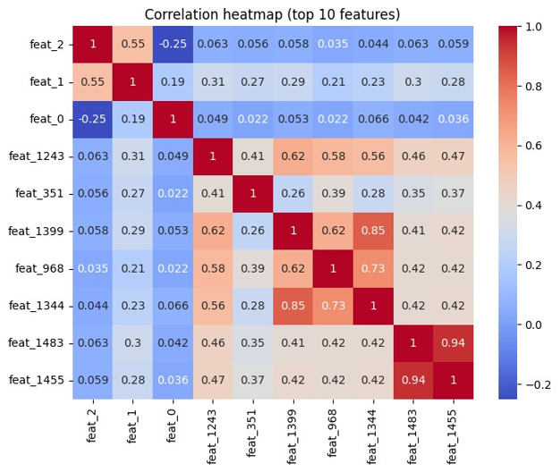
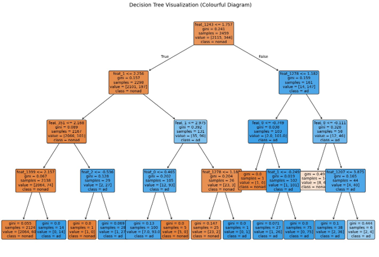
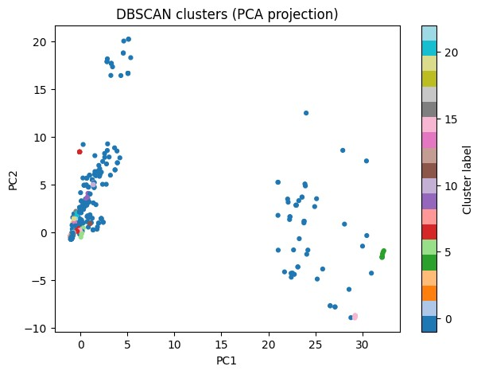

#Internet Advertisement Analysis

##Overview
Analysis of the Internet Advertisements Dataset using data mining and machine learning techniques.
The project includes :
-Data Cleaning and Preprocessing
-Feature Selection
-Statistical Analysis
-Data Visualization
-Decision Tree Classification
-DBSCAN Clustering
-PCA-based Visualization
-Association Rule Mining

##Dataset
Internet Advertisements Dataset

Source:
https://archive.ics.uci.edu/ml/datasets/Internet+Advertisements

##Techniques Used

##Data Preprocessing
-Missing value handling
-Numeric feature conversion
-Feature filtering

##Feature Selection
-Variance Threshold
-Mutual Information

###Visualization
-Histograms
-Box Plots
-Correlation Heatmaps
-Scatter Plots
-Violin Plots
-Pareto Charts

### Machine Learning
-Decision Tree Classification

###Clustering
-DBSCAN
-PCA Visualization

##Results

### Decision Tree Performance
-Accuracy: 95.1%
-Precision: 90.3%
-Recall: 73.0%
-F1 Score: 80.8%

## Technologies
-Python
-Pandas
-Numpy
-Matplotlib
-Seaborn
-Scikit-learn
-Mlxtend

## Repository Contents
-Advertisement_Analysis.ipynb
-report.pdf

## Visualizations

### Correlation Heatmap

### Decision Tree

### DBSCAN Clusterss

